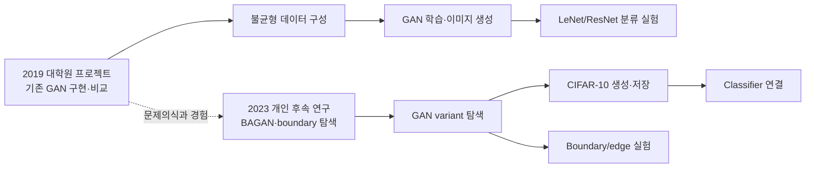
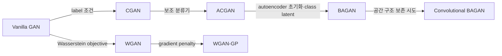
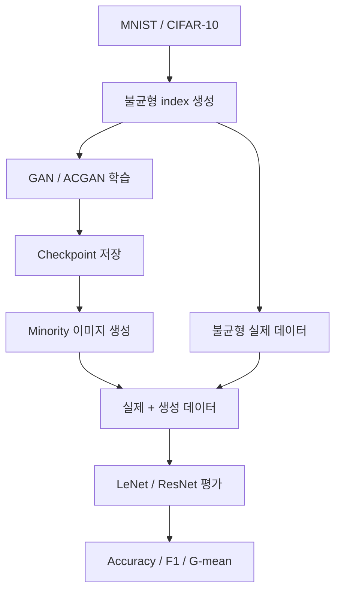
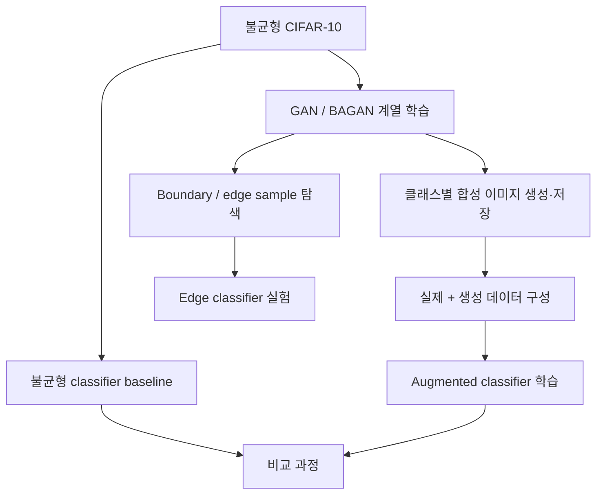
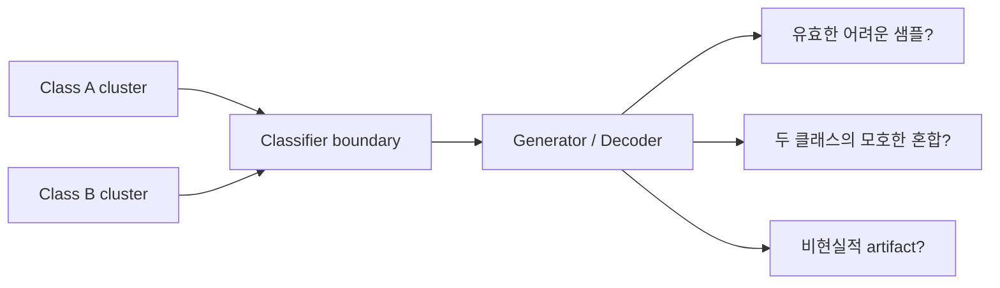

# 불균형 이미지 데이터를 위한 GAN 연구 아카이브

불균형 이미지 데이터에서 생성 모델 기반 oversampling을 탐구한 두 연구를 보존하고 설명하는 포트폴리오 저장소입니다.

> 이 저장소는 과거 코드를 최신 방식으로 다시 작성한 프로젝트가 아닙니다. 2019년 프로젝트와 2023년 개인 후속 연구의 원본 코드를 보존하고, 코드에서 확인되는 범위만 문서화했습니다.

## 한눈에 보기



두 시기의 연구는 연결되어 있지만 같은 실험의 연속 실행은 아닙니다. 코드베이스, 환경, 설정과 결과를 서로 구분해 해석해야 합니다.

## 문제와 연구 질문

불균형 데이터에서는 소수 클래스의 관측치가 적어 분류기뿐 아니라 생성 모델도 해당 분포를 충분히 학습하기 어렵습니다.

1. 기존 GAN 구조로 부족한 클래스의 이미지를 생성할 수 있는가?
2. 생성 데이터를 학습 데이터에 추가하는 과정은 어떻게 구성되는가?
3. 조건부 생성, Wasserstein objective, autoencoder 초기화는 불균형 학습에서 어떤 구조적 차이를 만드는가?
4. 분류 경계 근처의 유용한 샘플을 이미지 공간에서 어떻게 정의하고 검증할 것인가?

## 연구 범위

| 구분 | 성격 | 데이터 | 코드에서 확인되는 범위 |
| --- | --- | --- | --- |
| 2019 | 기존 GAN 구현·비교 프로젝트 | MNIST, CIFAR-10 | 불균형 subset, GAN/ACGAN 학습, checkpoint, 생성, LeNet/ResNet 평가 |
| 2023 | 2019 경험에서 출발한 개인 후속 연구 | 주로 MNIST, CIFAR-10 | 여러 GAN objective, BAGAN 변형, 이미지 생성, classifier 연결, boundary/edge 탐색 |

2023년 원본 GitHub의 `main`과 `1-feature-a` 브랜치를 모두 복구했습니다. `main`에는 초기 구조 실험 9개, `1-feature-a`에는 생성·분류·edge 실험을 포함한 29개 Python 파일이 있습니다.

## 구현 모델과 차이



| 모델 | 핵심 구조 | 불균형 데이터에서 확인할 문제 |
| --- | --- | --- |
| Vanilla GAN | 비조건부 noise → image, Real/Fake 판별 | 다수 클래스가 전체 생성 분포를 지배할 수 있음 |
| CGAN | Generator와 Discriminator에 label 조건 제공 | 소수 클래스 표본 자체가 적어 조건부 분포 학습이 부족할 수 있음 |
| ACGAN | Real/Fake와 class prediction을 함께 학습 | auxiliary classifier도 다수 클래스 신호에 치우칠 수 있음 |
| WGAN | scalar critic, Wasserstein objective, weight clipping | 학습 안정화가 클래스 불균형을 직접 해결하지는 않음 |
| WGAN-GP | clipping 대신 gradient penalty | 특정 소수 클래스 생성에는 별도 조건 구조가 필요함 |
| BAGAN | autoencoder 사전학습, class-aware latent sampling | 적은 표본으로 추정한 class latent 통계가 불안정할 수 있음 |
| Conv BAGAN | convolutional encoder/decoder | 공간 특징을 다루지만 covariance 계산 비용과 안정성 문제가 커질 수 있음 |

`bagan.py`는 fully connected autoencoder 기반 탐색이고, `bagan_conv.py` 및 CIFAR-10 변형들은 convolutional encoder/decoder를 사용한 후속 구조 탐색입니다. 보존 자료만으로 어느 변형이 최종적으로 우월했다고 결론 내리지는 않습니다.

## 코드에서 확인되는 실험 흐름

### 2019 프로젝트



### 2023 후속 연구



주요 파일:

- `generate_images_[wgan_gp_conv_cifar10].py`: 학습된 Generator 기반 이미지 저장
- `gan_to_classifier.py`: 생성 데이터와 classifier 실험 연결
- `gan_to_classifier_edge.py`: boundary/edge sample 기반 classifier 실험
- `train_classifier_imb.py`: 불균형 데이터 baseline
- `train_classifier.py`: 생성 데이터를 포함한 classifier 학습
- `models_gan.py`, `models_classifier.py`: 공통 모델 정의

자세한 내용은 [`experiments/2023_model_exploration/README.md`](experiments/2023_model_exploration/README.md)를 참고하세요.

## 결과와 증거 수준

2019 로컬 아카이브에는 136개 checkpoint와 4천여 개 생성 이미지가 남아 있어 학습과 생성이 수행됐음을 확인할 수 있습니다. checkpoint는 Git LFS로 추적하며, 대량의 개별 생성 이미지는 로컬에만 보존합니다.

현재 보존 자료만으로 동일 조건의 모델별 정량 비교나 통계적 우위를 확정할 수 없습니다. 따라서 확인되지 않은 accuracy, F1, FID 개선 수치나 “최종 성능 향상”을 기재하지 않습니다. 자세한 범위는 [`results/README.md`](results/README.md)에 정리했습니다.

## 연구 한계: boundary sample의 의미

2023년 연구의 관심 중 하나는 단순 복제가 아니라 decision boundary 근처의 유용한 샘플 생성이었습니다. 하지만 feature space에서 고양이와 개 사이에 놓인 점을 decode했을 때, 그 이미지가 다음 중 무엇인지 자동으로 알 수 없습니다.



- boundary는 데이터의 고정 속성이 아니라 classifier와 feature representation에 의존합니다.
- latent interpolation의 중간점이 의미 있는 semantic boundary라는 보장이 없습니다.
- 경계 샘플의 정답 label은 본질적으로 모호할 수 있습니다.
- 잘못 생성된 샘플에 hard label을 붙이면 label noise가 될 수 있습니다.
- realism과 boundary proximity를 함께 평가할 별도 기준이 필요합니다.

향후 검증에는 classifier feature space에서의 경계 정의, confidence 기반 filtering, soft label, 사람 또는 별도 모델의 유효성 검사가 필요합니다.

## 저장소 구조

```text
gan_project/
├─ experiments/
│  ├─ 2019_baselines/original/            # 2019 원본 코드·checkpoint·로컬 산출물
│  └─ 2023_model_exploration/branches/
│     ├─ main/                             # 2023 초기 구조 실험 9개
│     └─ 1-feature-a/                      # 생성·분류·edge 후속 실험 29개
├─ docs/                                   # 범위, 원본 매핑, 변경 원칙
├─ data/                                   # 데이터 배치 안내
├─ results/                                # 결과 공개 및 보존 원칙
├─ tools/toy_smoke_test.py                 # 비학습 최소 검증
├─ requirements-toy.txt
└─ requirements-legacy-cli.txt
```

## 실행과 검증

원본 연구 스크립트는 import 시 데이터 로딩이나 학습을 시작하고 상대경로·과거 API·로컬 경로를 사용합니다. 따라서 현재 환경에서 바로 재현 가능한 패키지로 소개하지 않습니다.

### Toy smoke test

전체 데이터 학습 없이 70개 Python 파일의 문법, 2019 GAN/ACGAN forward pass와 비학습 toy 이미지 저장 경로를 확인합니다.

```powershell
py -3.11 -m venv .venv
.\.venv\Scripts\Activate.ps1
python -m pip install -r requirements-toy.txt
python tools/toy_smoke_test.py
```

macOS/Linux에서는 `python3.11 -m venv .venv`, `source .venv/bin/activate`를 사용합니다. 생성되는 `results/toy_samples/untrained_mnist_generator.png`는 연구 결과가 아니라 저장 경로를 확인하는 비학습 산출물이며 Git에서 제외됩니다.

### 2019 원본 CLI 확인

```powershell
python -m pip install -r requirements-legacy-cli.txt
cd experiments/2019_baselines/original
python extract_imbalanced_index.py --help
python main.py --help
python oversampling.py --help
```

전체 end-to-end 재현에는 데이터 다운로드, 불균형 index 생성, checkpoint 및 상대경로 설정이 추가로 필요합니다. 2023 스크립트에는 안전한 공통 CLI wrapper가 없으므로 환경과 경로를 확인하지 않은 일괄 실행을 권장하지 않습니다.

## 출처

- 2019 프로젝트: 개인 로컬 연구 아카이브
- 2023 개인 후속 연구: <https://github.com/DDohyeon2941/gan_for_imbalanced_dataset>
- 일부 ACGAN 참고 구현: 원본 코드 디렉터리의 README와 LICENSE를 함께 보존
