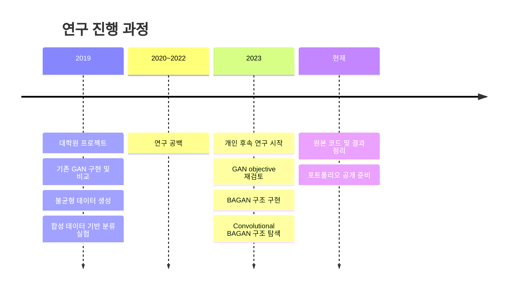
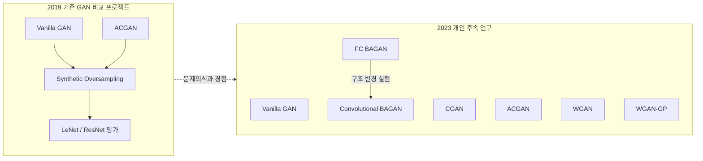
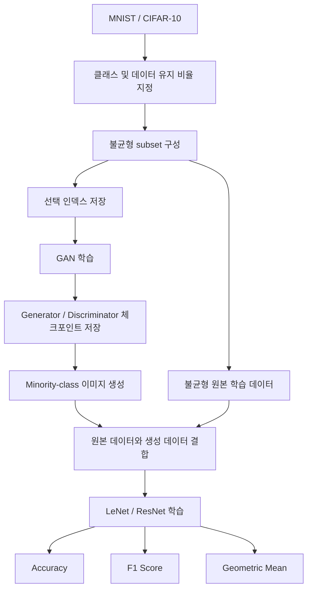
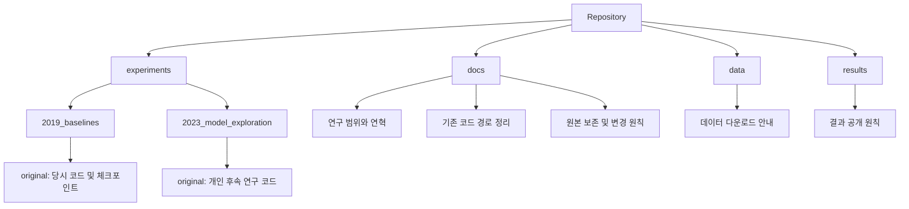

# 불균형 이미지 데이터를 위한 GAN 실험 아카이브

이 저장소는 불균형 이미지 데이터에서 GAN 기반 oversampling을 탐구한 두 시기의 연구 코드를
한곳에 정리한 포트폴리오용 아카이브다.

- **2019년 프로젝트:** 기존 GAN을 구현하고 불균형 MNIST/CIFAR-10에서 생성 및 분류 실험 수행
- **2023년 개인 후속 연구:** 2019년 프로젝트의 문제의식을 바탕으로 여러 GAN objective와
  BAGAN 계열 모델 구조를 다시 탐색

두 연구는 주제와 동기 면에서 연결되지만 코드베이스와 실험 설정은 서로 다르다. 따라서 결과를
하나의 연속된 benchmark처럼 직접 비교하지 않는다.



## 문제 정의

이미지 분류 데이터에서 일부 클래스의 표본이 부족하면 분류기가 다수 클래스에 편향될 수 있다.
이 연구에서는 GAN이 생성한 minority-class 이미지를 학습 데이터에 추가하는 방법을 실험했다.

## 연구 질문

1. 기존 GAN 구조로 불균형 데이터의 부족한 클래스를 생성할 수 있는가?
2. 생성 데이터를 추가했을 때 downstream classifier의 불균형 분류 지표가 어떻게 달라지는가?
3. 서로 다른 adversarial objective와 conditional structure는 minority-class 생성에 어떤 구조적
   차이를 만드는가?
4. BAGAN의 fully connected 구조를 convolutional encoder/decoder로 변경하면 어떤 계산 및 구현상
   문제가 발생하는가?

## 데이터셋

- MNIST
- CIFAR-10

2019년 코드는 클래스 번호와 유지 비율을 받아 원본 데이터에서 일부 클래스의 표본을 추출하고,
추출 인덱스를 저장해 GAN 학습과 분류 평가에서 재사용한다. 데이터셋 파일 자체는 이 저장소에
포함하지 않는다.

## 구현 및 실험 모델

코드에서 다음 모델을 확인했다.

- Vanilla GAN
- Conditional GAN (CGAN)
- Auxiliary Classifier GAN (ACGAN)
- Wasserstein GAN (WGAN)
- Wasserstein GAN with Gradient Penalty (WGAN-GP)
- Balancing GAN 계열 fully connected 구현
- Convolutional encoder/decoder를 적용한 BAGAN 구조 실험



2019년 프로젝트에는 MNIST/CIFAR-10용 Generator와 Discriminator, 불균형 데이터 생성,
체크포인트 저장, 합성 이미지 생성, LeNet/ResNet 기반 downstream 평가가 포함되어 있다.

2023년 후속 연구의 `bagan.py`는 fully connected autoencoder를 사용한다. `bagan_conv.py`는 같은
아이디어를 convolutional autoencoder로 바꾼 탐색 코드다. 이는 검증된 최종 모델이 아니라 모델
구조를 실험하던 연구 과정으로 기록한다.

## 실험 파이프라인



## 실험 결과

로컬 원본에는 학습 체크포인트 136개와 생성 이미지 4천여 개가 남아 있다. 이는 당시 실험이
수행되었음을 보여주지만, 특정 모델의 성능 향상을 입증하는 완성된 비교표는 확인되지 않았다.
따라서 확인되지 않은 accuracy, F1, FID 또는 성능 개선 수치는 기재하지 않는다.

개별 생성 이미지는 저장소 용량과 탐색성을 고려해 Git에 올리지 않고 로컬 작업 폴더에만 보존한다.
`.pkl` 체크포인트는 Git LFS 추적 대상으로 설정했다.

## 한계

- 과거 Python/PyTorch 환경이 정확히 고정되어 있지 않다.
- 일부 코드는 현재 PyTorch에서 제거된 API를 사용한다.
- random seed와 device 설정이 모든 실험에서 일관되지 않다.
- 두 시기의 실험은 동일한 설정으로 수행한 직접 비교 실험이 아니다.
- 저장된 결과만으로 모델별 통계적 우위를 주장할 수 없다.
- 외부 ACGAN 공개 구현을 참고한 코드는 원본 라이선스와 출처를 함께 보존한다.

## 저장소 구조



| 경로 | 내용 |
| --- | --- |
| `experiments/2019_baselines/original/` | 2019년 당시 코드와 LFS 체크포인트 |
| `experiments/2023_model_exploration/original/` | 2023년 개인 후속 연구 코드 |
| `docs/` | 연구 범위, 원본 경로, 변경 원칙 |
| `data/` | 데이터셋 관리 안내 |
| `results/` | 결과 공개 및 보존 원칙 |

## 코드 실행에 관하여

`original/`의 Python 파일은 연구 당시 상태를 보존하기 위해 수정하지 않았다. 이 때문에 최신
환경에서 바로 실행되지 않을 수 있으며 실행 위치에 따라 상대경로 설정이 필요하다. 당시 코드의
CLI 인자는 각 실험 디렉터리에서 다음 명령으로 확인할 수 있다.

```bash
python main.py --help
python extract_imbalanced_index.py --help
python oversampling.py --help
```

원본 전체 학습은 아직 재현하지 않았지만, 아래 toy smoke test와 2019년 원본 CLI의 `--help`는
Python 3.11 환경에서 검증했다. 원본 코드의 동작을 바꾸는 수정은
`docs/behavior_changes.md`에 기록한다.

### Toy smoke test

전체 데이터셋을 받거나 GAN을 학습하지 않고 다음 항목을 빠르게 확인할 수 있다.

- 2019·2023년 원본 Python 파일 41개의 문법
- 2019년 MNIST/CIFAR-10 Vanilla GAN의 forward pass와 출력 shape
- 2019년 ACGAN Generator/Discriminator의 forward pass와 출력 shape
- 학습 전 MNIST Generator의 toy 출력 이미지 저장

Windows PowerShell:

```powershell
py -3.11 -m venv .venv
.\.venv\Scripts\Activate.ps1
python -m pip install -r requirements-toy.txt
python tools/toy_smoke_test.py
```

macOS/Linux:

```bash
python3.11 -m venv .venv
source .venv/bin/activate
python -m pip install -r requirements-toy.txt
python tools/toy_smoke_test.py
```

성공하면 다음 메시지가 출력된다.

```text
[통과] 원본 Python 파일 문법 검사: 41개
[통과] 2019 Vanilla GAN: MNIST/CIFAR-10 forward pass
[생성] results/toy_samples/untrained_mnist_generator.png
[통과] 2019 ACGAN: Generator/Discriminator forward pass
[완료] 데이터 없는 toy smoke test를 모두 통과했습니다.
```

생성되는 이미지는 학습되지 않은 Generator의 무작위 출력이다. 이미지 품질을 보여주는 연구 결과가
아니라 tensor 생성과 파일 저장 경로가 동작하는지 확인하는 테스트 산출물이다. 이 파일은
`.gitignore`에 따라 GitHub에는 올라가지 않는다.

이 검사는 모델 정의의 최소 동작을 확인하는 용도이며 전체 학습 재현이나 과거 성능 수치 검증을
대체하지 않는다.

### 2019년 원본 CLI 확인

원본 코드는 실행 위치에 상대경로를 사용하므로 먼저 해당 디렉터리로 이동한다.

```powershell
python -m pip install -r requirements-legacy-cli.txt
cd experiments/2019_baselines/original
python extract_imbalanced_index.py --help
python main.py --help
python oversampling.py --help
```

위 세 CLI의 도움말 출력은 Python 3.11.9, PyTorch 2.14.0 환경에서 확인했다. 실제 전체 학습에는
데이터 다운로드, 불균형 인덱스 생성, 경로 설정이 추가로 필요하며 아직 end-to-end 재현을 완료하지
않았다.

2023년 원본 파일은 import와 동시에 데이터 로딩 및 학습을 시작하는 실험 스크립트가 포함되어
있다. 따라서 toy test에서는 문법만 검사하며, 별도 환경 검증 없이 일괄 실행하지 않는다.

## 코드와 결과의 출처

- 2019년 프로젝트 원본: 로컬 연구 자료에서 이전
- 2023년 개인 후속 연구 원본:
  <https://github.com/DDohyeon2941/gan_for_imbalanced_dataset>
- ACGAN 참고 구현: 원본 `README.md`와 `LICENSE`를 해당 코드 디렉터리에 보존
