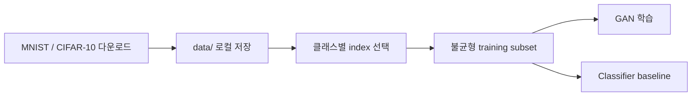

# 데이터 관리

MNIST와 CIFAR-10 데이터는 실행 환경에서 내려받으며 원본 dataset과 cache는 Git에 포함하지 않습니다.

과거 스크립트마다 상대경로와 다운로드 위치가 다를 수 있습니다. 실행 전 해당 파일의 `root`, `data_path`, `download` 설정을 확인해야 합니다. 데이터 파일을 추가로 내려받더라도 저장소에 커밋하지 마세요.
