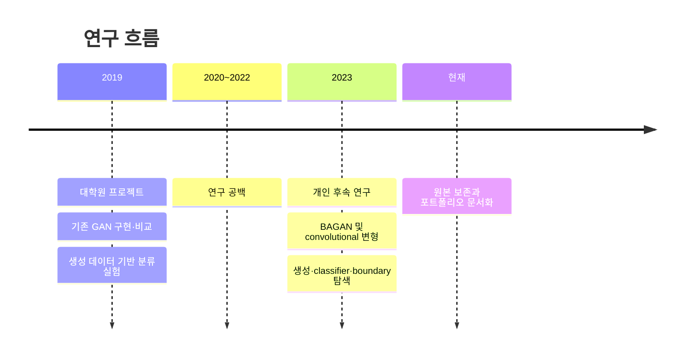

# 연구 범위와 표현 원칙

## 연구 관계

2023년 연구는 2019년 프로젝트에서 얻은 문제의식과 경험을 바탕으로 시작했습니다. 그러나 별도 코드베이스와 설정을 사용했으므로 하나의 연속 benchmark나 이전 결과 대비 성능 향상으로 표현하지 않습니다.

## 2019 프로젝트

- 데이터: MNIST, CIFAR-10
- 성격: 기존 GAN 구현과 비교 프로젝트
- 확인 가능한 기능: 불균형 index, GAN/ACGAN 학습, checkpoint, 이미지 생성, LeNet/ResNet 분류 평가 코드
- 원본: 개인 로컬 연구 아카이브

## 2023 개인 후속 연구

- 데이터: 코드상 MNIST와 CIFAR-10, 후속 흐름은 주로 CIFAR-10
- 성격: 여러 adversarial objective와 BAGAN 계열 구조 탐색
- 확인 가능한 기능: GAN 변형 학습, 이미지 생성·저장, baseline/증강 classifier, edge/boundary 실험 코드
- 원본: GitHub `main`, `1-feature-a` 브랜치

## 성과 기술 원칙

- 코드나 복구된 결과로 확인 가능한 기능만 기술합니다.
- checkpoint와 생성 이미지는 실험 수행의 증거이지 성능 우위의 증거가 아닙니다.
- 재현 가능한 지표 파일 또는 재실행 결과가 없으면 수치를 제시하지 않습니다.
- “최종 모델”보다는 “연구가 집중된 구조” 또는 “구조 탐색”으로 표현합니다.
- 2019와 2023 결과는 직접 수치 비교하지 않습니다.
- 참고 구현은 출처와 라이선스를 보존합니다.
