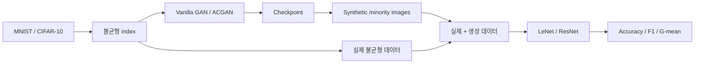

# 2019년 프로젝트: 기존 GAN 비교 실험

인위적으로 불균형하게 구성한 MNIST와 CIFAR-10에서 기존 GAN을 구현하고, 생성 이미지를 분류 학습에 연결한 프로젝트입니다. 이 경험이 2023년 개인 후속 연구의 출발점이 됐지만 두 실험은 별도 코드베이스입니다.

## 코드에서 확인되는 흐름



| 파일 | 역할 |
| --- | --- |
| `original/extract_imbalanced_index.py` | 클래스별 유지 비율에 따른 불균형 index 생성 |
| `original/main.py`, `original/model.py` | Vanilla GAN 학습 및 MNIST/CIFAR-10 모델 |
| `original/oversampling.py` | checkpoint 기반 합성 이미지 생성 |
| `original/AC_GAN/main.py`, `model.py` | ACGAN 학습과 모델 |
| `original/Classification/cnn_main.py` | 생성 데이터를 포함한 downstream 분류 실험 |
| `original/Classification/cnn_model.py` | LeNet/ResNet 분류기 |

## 보존 상태

- 연구 당시 Python 파일 32개를 원래 상대경로 구조로 보존했습니다.
- 로컬 아카이브에는 checkpoint 136개와 생성 이미지 4천여 개가 있습니다.
- checkpoint는 Git LFS로 추적합니다.
- 대량의 생성 이미지는 로컬에는 보존하지만 GitHub에는 업로드하지 않습니다.
- dataset 원본, Python cache, IDE 설정과 압축 파일은 추적하지 않습니다.

산출물의 존재는 당시 학습과 생성이 수행됐다는 증거이지만 모델별 개선을 입증하는 정량 비교표는 아닙니다. 복구된 지표 파일이나 동일 조건 재실행 없이 성능 수치를 만들지 않습니다.

## 최소 실행 확인

저장소 루트의 `tools/toy_smoke_test.py`가 모델 import, forward pass와 toy 이미지 저장을 확인합니다.

```powershell
python -m pip install -r requirements-legacy-cli.txt
cd experiments/2019_baselines/original
python extract_imbalanced_index.py --help
python main.py --help
python oversampling.py --help
```

전체 학습에는 데이터 다운로드, 불균형 index, 상대경로 및 checkpoint 설정이 별도로 필요합니다.
