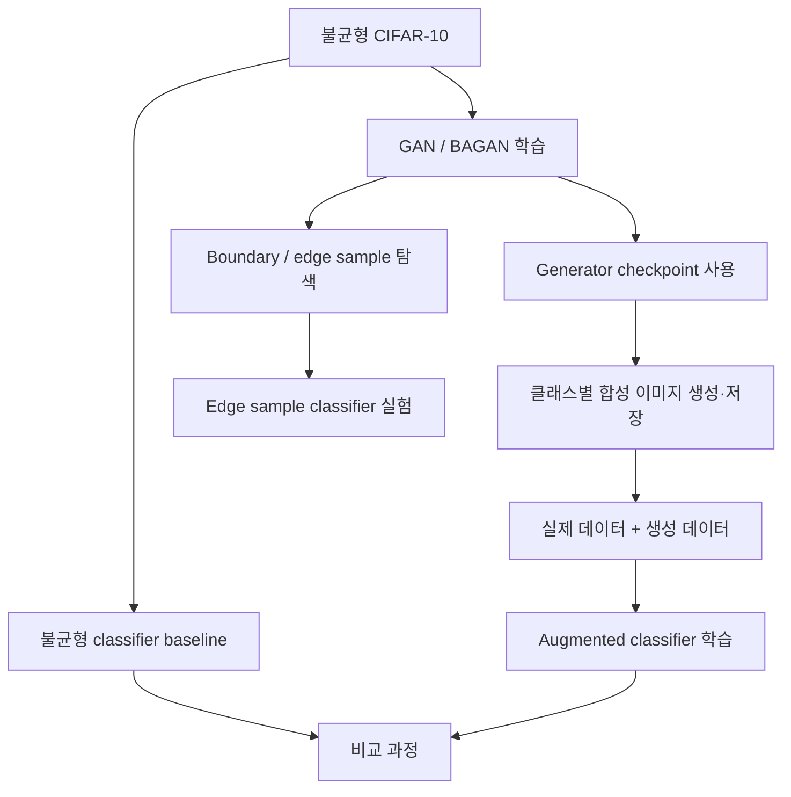
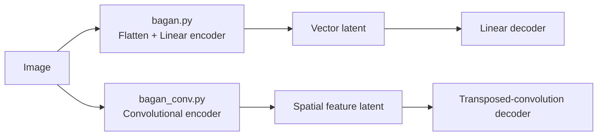

# 2023년 개인 후속 연구

2019년 프로젝트에서 경험한 불균형 이미지 생성 문제를 2023년에 별도 코드베이스로 다시 탐색한 개인 연구입니다. 원본 저장소의 두 브랜치를 수정 없이 분리 보존했습니다.

원본: <https://github.com/DDohyeon2941/gan_for_imbalanced_dataset>

## 브랜치 구성

| 경로 | 원본 브랜치 | 보존 내용 |
| --- | --- | --- |
| `branches/main/` | `main` | Vanilla GAN, CGAN, ACGAN, WGAN, WGAN-GP, BAGAN 구조 실험 9개 |
| `branches/1-feature-a/` | `1-feature-a` | CIFAR-10 BAGAN 변형, 생성, classifier, boundary/edge 실험 29개 |

중복 파일도 삭제하지 않았습니다. 각 디렉터리는 해당 시점의 브랜치 snapshot이며, 파일 내용과 학습 로직은 원본 그대로입니다.

## 복구된 전체 실험 과정

| 단계 | 주요 파일 | 코드에서 확인되는 역할 |
| --- | --- | --- |
| GAN 모델 | `models_gan.py` | Generator와 Discriminator 정의 |
| WGAN-GP | `wgan_gp_conv_cifar10.py`, `wgan_gp_conv_cifar10_new.py` | CIFAR-10 convolutional WGAN-GP 변형 |
| BAGAN 변형 | `bagan_conv_cifar10*.py` | 기본, binary, edge, projection, upscale 변형 |
| 제안 구조 | `proposed_wgan_gp_conv_cifar10*.py` | 제안 구조 및 TensorBoard 기록 변형 |
| 이미지 생성 | `generate_images_[wgan_gp_conv_cifar10].py` | 학습된 Generator로 이미지 생성·저장 |
| 분류 모델 | `models_classifier.py` | downstream classifier 정의 |
| Baseline | `train_classifier_imb.py` | 불균형 원본 데이터 classifier 학습 |
| 증강 평가 | `train_classifier.py`, `gan_to_classifier.py` | 생성 데이터를 포함한 classifier 과정 |
| 경계 실험 | `implementation_edge.py`, `gan_to_classifier_edge.py` | edge/boundary sample 구성 및 분류 연결 |

## BAGAN과 `bagan_conv`의 차이

- `bagan.py`: fully connected autoencoder를 중심으로 class별 latent 분포와 GAN 초기화를 탐색합니다.
- `bagan_conv.py`: 이미지 공간 구조를 다루기 위해 encoder/decoder를 convolutional 계층으로 바꾼 탐색입니다.
- `bagan_conv_cifar10*.py`: CIFAR-10에 맞춘 여러 조건·출력·edge 변형입니다.

이는 구조상 차이를 설명한 것이며, 보존 자료만으로 convolutional 변형의 성능 우위를 주장하지 않습니다.

## Boundary/edge 연구의 한계

목표는 분류 경계 근처의 유용한 샘플을 생성하는 것이었지만 이미지 공간에서 “두 클래스의 중간”은 명확한 정답이 아닙니다.

- decision boundary는 선택한 classifier와 feature space에 따라 달라집니다.
- latent 중간점이 의미 있는 이미지 의미론과 일치한다는 보장이 없습니다.
- 생성물이 유효한 hard example인지, 모호한 혼합인지, artifact인지 구별해야 합니다.
- 모호한 생성물에 hard label을 주면 label noise가 될 수 있습니다.

성능을 주장하려면 realism, diversity, boundary proximity, label reliability와 downstream 성능을 함께 평가해야 합니다. 현재 저장소에는 이를 완결된 동일 조건 실험으로 입증할 자료가 충분하지 않습니다.

## 실행 주의사항

이 디렉터리의 파일은 2023년 원본 snapshot입니다. 일부 스크립트는 import와 동시에 데이터 로딩이나 학습을 시작하고 로컬 상대경로를 전제로 합니다. 원본 보존을 위해 CLI나 경로를 직접 고치지 않았으며, 현재 toy test는 문법 검사만 수행합니다.
