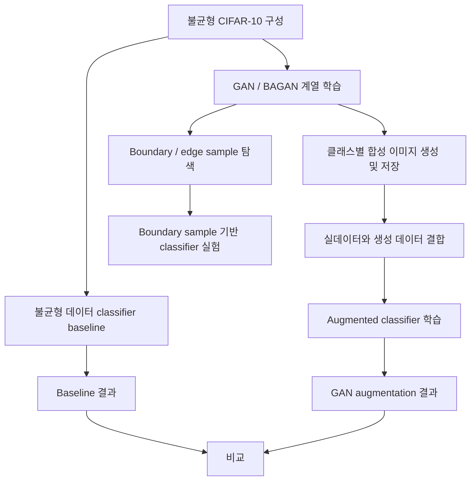

# 2023년 개인 후속 연구

2019년 프로젝트에서 다룬 불균형 데이터 문제를 별도의 개인 연구 코드베이스에서 다시 탐구한
작업이다.

원본 저장소: <https://github.com/DDohyeon2941/gan_for_imbalanced_dataset>

여러 GAN objective와 conditional structure를 실험한 뒤 연구 방향은 최종적으로 BAGAN에
집중했다. `bagan_conv.py`는 fully connected 구조의 `bagan.py` 이후 convolutional
encoder/decoder를 적용해 본 구조 탐색 코드로 정리한다. 완료된 비교 평가를 뒷받침할 자료가
충분하지 않으므로 성능이 검증된 최종 모델로 표현하지 않는다.

## 브랜치별 코드

| 경로 | 원본 브랜치 | 내용 |
| --- | --- | --- |
| `branches/main/` | `main` | Vanilla GAN, CGAN, ACGAN, WGAN, WGAN-GP, 초기 BAGAN 구조 실험 9개 |
| `branches/1-feature-a/` | `1-feature-a` | CIFAR-10 BAGAN 변형, 이미지 생성, classifier 연결, boundary/edge 실험 등 29개 |

원본 파일은 브랜치별로 구분해 수정 없이 보존했다. 공통 파일이 중복되더라도 서로 다른 시점의
브랜치 상태를 보여주기 위해 제거하지 않았다.

## 실제 실험 프로세스

`1-feature-a` 브랜치에는 `main`에서 확인되지 않았던 생성 및 downstream 분류 실험이 포함되어
있다.

| 파일 | 역할 |
| --- | --- |
| `generate_images_[wgan_gp_conv_cifar10].py` | 학습된 Generator를 이용한 이미지 생성 및 저장 |
| `gan_to_classifier.py` | GAN 생성 데이터를 classifier 학습 과정에 연결 |
| `gan_to_classifier_edge.py` | Boundary/edge sample을 이용한 classifier 실험 |
| `train_classifier.py` | 생성 데이터를 포함한 classifier 학습 |
| `train_classifier_imb.py` | 불균형 원본 데이터의 classifier baseline |
| `models_gan.py` | Generator 및 Discriminator 모델 정의 |
| `models_classifier.py` | Downstream classifier 정의 |
| `bagan_conv_cifar10*.py` | CIFAR-10 BAGAN 및 구조 변형 실험 |
| `proposed_wgan_gp_conv_cifar10*.py` | 제안 구조와 TensorBoard 기록 실험 |

## 연구 한계

연구 목표 중 하나는 클래스 decision boundary 근처의 샘플을 생성하는 것이었다. 그러나 이미지
공간에서는 dog도 cat도 아닌 중간 형태가 무엇인지 명확하게 정의하기 어렵다. Latent space에서 두
클래스 사이에 있는 점이 실제로 의미 있는 어려운 사례가 된다는 보장도 없다. 모호하거나
비현실적인 합성 이미지에 hard label을 부여하면 classifier 학습에서 label noise로 작용할 수 있다.

따라서 boundary sample을 활용하려면 다음이 추가로 필요하다.

- 특정 classifier의 feature space에서 decision boundary를 명시적으로 정의
- 생성 이미지의 realism과 boundary proximity를 함께 측정
- confidence 기반 sample filtering
- hard label 대신 soft label을 사용하는 방법 검토
- 생성 샘플을 추가하기 전 사람 또는 별도 모델을 통한 유효성 검사

당시 저장소의 Python 파일은 `main` 9개, `1-feature-a` 29개로 나누어 보존했다.
