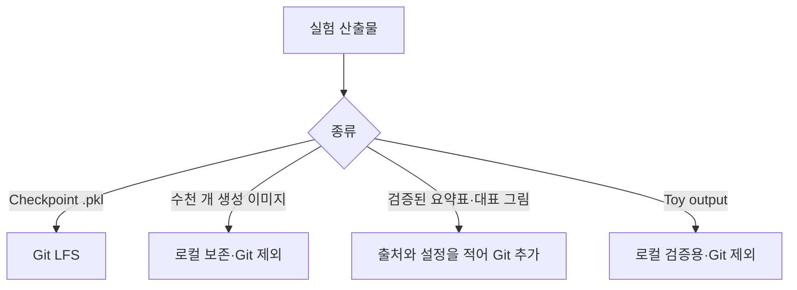

# 실험 결과와 공개 범위

이 디렉터리는 새 성능 수치를 만들어 넣는 공간이 아니라, 과거 산출물의 위치와 증거 수준을 명확히 기록하는 곳입니다.

## 현재 확인된 자료

| 시기 | 확인된 자료 | GitHub 공개 방식 | 해석 가능한 범위 |
| --- | --- | --- | --- |
| 2019 | checkpoint 136개, 생성 이미지 4천여 개, loss graph | checkpoint는 Git LFS, 대량 이미지는 로컬만 보존 | 학습·저장·생성 과정이 수행됐음 |
| 2023 | `1-feature-a`의 생성·classifier·edge 실험 코드 | 원본 Python 코드 공개 | 해당 실험 과정이 구현됐음 |
| Toy test | 학습되지 않은 MNIST Generator 출력 | Git 추적 제외 | forward pass와 저장 경로가 동작함 |

## 이 자료만으로 주장하지 않는 것

- 특정 GAN이 다른 모델보다 통계적으로 우수하다는 결론
- 생성 데이터가 accuracy, F1, G-mean 또는 FID를 일정 수치만큼 개선했다는 주장
- boundary/edge sample이 실제 classifier 성능을 개선했다는 결론
- 서로 다른 연도와 설정의 결과를 하나의 동일 조건 benchmark처럼 비교하는 것

## 파일 관리 원칙

향후 정량 결과를 추가할 때는 실행한 commit, 데이터 불균형 설정, seed, 모델과 hyperparameter, 평가 지표 계산법을 함께 기록합니다.
